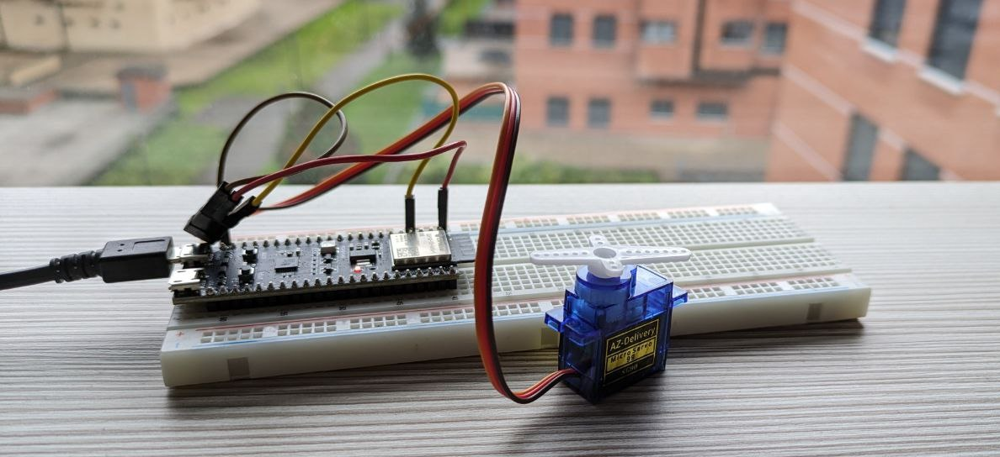

# Zephyr RTOS Servomotor Control with ESP32

This repository demonstrates how to control a servomotor using an ESP32 microcontroller and Zephyr RTOS. The code utilizes the PWM Zephyr API which integrates the LEDC (LED Controller) library provided by Espressif to generate Pulse Width Modulation (PWM) signals for the control of the servomotor.



## Servomotor Overview

A servomotor is a rotary actuator or linear actuator that allows for precise control of angular or linear position, velocity, and acceleration. It consists of a motor coupled with a feedback mechanism that senses the position and adjusts the motor's speed and direction accordingly. Servomotors are commonly used in robotics, remote-controlled vehicles, automation systems, and other applications requiring precise motion control.

## Code Explanation

The provided code initializes a PWM channel using the LEDC library to control the servomotor. Here's a brief explanation of the main code segments:

- **PWM Configuration**: The code configures the PWM channel parameters such as period and pulse width. The period is set to 20ms to generate a 50Hz signal, which is the standard frequency for servomotors. The minimum and maximum pulse widths correspond to 0° and 180° positions, respectively, with a step size of approximately 10°.

- **Main Loop**: The main loop continuously adjusts the pulse width of the PWM signal to move the servomotor in a sweeping motion. It alternates between increasing and decreasing the pulse width within the defined range.

## Overlay Configuration

The most important part of this repository is the device tree overlay which configures the esp32 to setup a the GPIO2 to generate a PWM signal trhough the Espressif's LEDC library. 

The Espressif's LEDC library is a peripheral driver for generating PWM signals on ESP32 microcontrollers. It provides a flexible interface for configuring PWM channels with customizable frequency and duty cycle. The LEDC library is commonly used for driving LEDs, servomotors, and other PWM-controlled devices.

The core of the overlay is the pwm node named `pwmleds` which defines a node for PWM signal compatible with "pwm-leds". Inside this node, a child node named pwm_servo0 is defined which configures the PWM signal parameters using the pwms properties: a reference to the LEDC controller (&ledc0), the PWM channel index (0), the frequency in Hz (50 Hz) and PWM polarity is set to normal. Besides, an alias is created for this node named `pwm-servo0`, which will be used for accessing the pin in the code.

```
/ {
	aliases {
		pwm-servo0 = &pwm_servo0;
	};

	pwmleds {
		compatible = "pwm-leds";
		pwm_servo0: pwm_led_gpio0_2 {
			label = "PWM SERVO0";
			pwms = <&ledc0 0 50 PWM_POLARITY_NORMAL>;
		};
	};
};
```

The LEDC node (`ledc0`) uses pin control (pinctrl) to configure the PWM pin. Thus, we create a new node named `ledc0_default` which defines a group whose pinmux is `LEDC_CH0_GPIO2`, that is, the GPIO2 as LEDC pin:

```
&pinctrl {
	ledc0_default: ledc0_default {
		group1 {
			pinmux = <LEDC_CH0_GPIO2>;
			output-enable;
		};
	};
};
```

It is possible to define a different pin instaed of GPIO2. For this aim, you need to check the `zephyrproject\modules\hal\espressif\include\dt-bindings\pinctrl\esp32-pinctrl.h` file and check out if your desired GPIO is defined.

Finally, the LEDC node is defined with the pinctrl previous node:

```
&ledc0 {
	pinctrl-0 = <&ledc0_default>;
	pinctrl-names = "default";
	status = "okay";
	#address-cells = <1>;
	#size-cells = <0>;
	channel0@0 {
		reg = <0x0>;
		timer = <0>;
	};
};
```

## Set up Zephyr
Open your terminal and clone the Zephyr RTOS:

```bash
git clone https://github.com/zephyrproject-rtos/zephyr.git
```

check out the branch into **version 3.5** to get a stable Zephyr version instead of developing directly into main:
```bash
git checkout v3.5-branch
```

Then, download the Zephyr SDK from the [official Zephyr repository](https://github.com/zephyrproject-rtos/sdk-ng/tags). Download the **v0.16.4** version which is the suitable SDK for Zephyr 3.5 release.

Add the Zephyr binary directory to your PATH and set the `ZEPHYR_BASE` variable. For example:

```bash
export ZEPHYR_SDK_INSTALL_DIR=<path_to_sdk>
source <path_to_zephyr>/zephyr-env.sh
```

## Build
Build the project for esp32. It was tested with esp32s3 board:

```
west build -b esp32s3_devkitm
```

## Flash
After building the project, flash the compiled binary to the ESP32 microcontroller. You can specify the port using the esp32 flasher and the option `--esp-device`, for example, the port COM26:

```
west flash -r esp32 --esp-device COM26
```
## Conclusion

This project demonstrates how to control a servomotor using Zephyr RTOS and the ESP32 microcontroller. By leveraging the LEDC library and device tree configuration, developers can easily implement precise motion control applications with Zephyr on ESP32-based hardware.

For detailed instructions and additional resources, refer to the project's documentation and the Zephyr RTOS documentation. Happy coding!